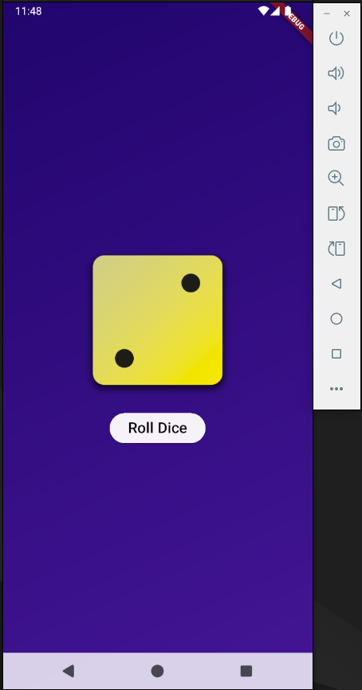

## Dice Roller

A simple flutter app that rolls a dice.

It shows a random dice image every time the button is pressed.

### What did I learn?

- Flutter and Dart basics
- Variables, functions, types and classes in Dart
- Creating custom widgets
- Splitting a widget into multiple files
- Stateless vs Statefull widgets

### Screenshots

